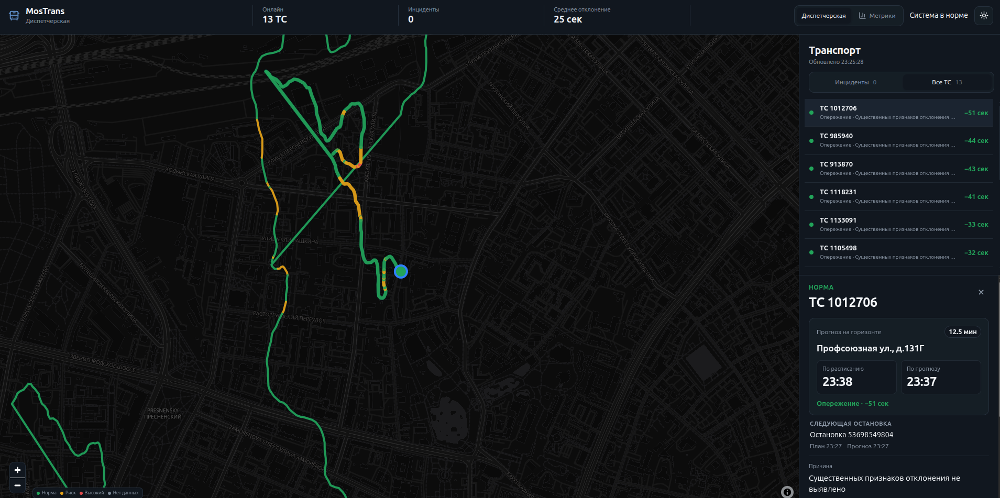
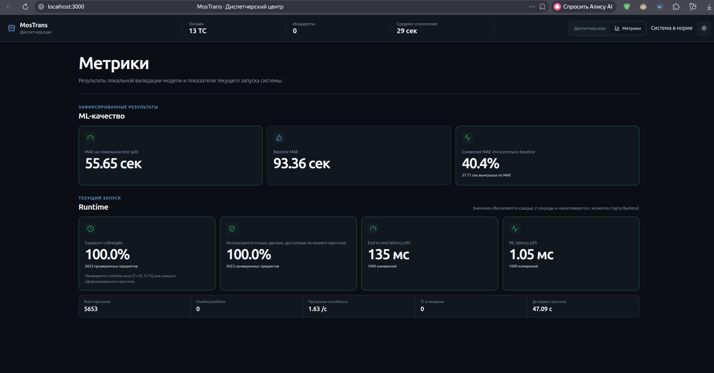

# MosTrans — предиктор изменений графика движения городского транспорта

**Команда:** «Ботанский клуб»  

MosTrans принимает телеметрию транспортных средств в реальном времени, сопоставляет её с эталонным расписанием, рассчитывает текущие производные признаки и прогнозирует отклонение от графика на горизонте **12.5 минут**. Результаты отображаются на диспетчерском dashboard с картой, цветовой индикацией риска, прогнозируемым временем прибытия, причиной отклонения и рекомендацией оператору.

---

## Быстрый запуск

### Требования

- Docker
- Docker Compose

### Запуск всей системы

Из корня проекта:

```bash
docker compose up --build
```

После старта доступны:

| Компонент | Адрес |
|---|---|
| Диспетчерский dashboard | http://localhost:3000 |
| Backend Swagger | http://localhost:8000/docs |
| Backend OpenAPI | http://localhost:8000/openapi.json |
| ML Service Swagger | http://localhost:8001/docs |
| ML Service OpenAPI | http://localhost:8001/openapi.json |
| NDTP TCP endpoint | `localhost:9201` |

Проверить состояние контейнеров:

```bash
docker compose ps
```

Остановить систему:

```bash
docker compose down
```

### Подтверждение запуска

Скриншот холодного запуска с зафиксированным временем:

[Открыть скриншот времени запуска](docs/screenshots/docker_proof.jpg)


---


## Как подать NDTP-поток на решение

После запуска системы командой `docker compose up --build` Backend начинает слушать входящий NDTP-поток на TCP-порту **9201** хост-машины:

```text
TCP <HOST>:9201
```

Если проверка проводится на той же машине, снаружи Docker Compose достаточно использовать:

```text
localhost:9201
```

### Предоставленный NDTP-эмулятор

Загрузить Docker-образ эмулятора:

```bash
docker load -i ndtp-telemetry-emulator.tar
```

Запустить эмулятор:

```bash
docker run --rm \
  -p 18080:18080 \
  --add-host=host.docker.internal:host-gateway \
  --name ndtp-emu \
  ndtp-telemetry-emulator:1.0
```

REST API эмулятора после запуска доступен на:

```text
http://localhost:18080
```

Пример минимального `ndtp-config.json`:

```json
{
  "targetHost": "host.docker.internal",
  "targetPort": 9201,
  "units": [
    {
      "unitId": 893159,
      "intervalMs": 1000,
      "autoGenerate": true,
      "cells": []
    }
  ]
}
```

Передать конфигурацию эмулятору и сразу начать отправку NDTP-пакетов:

```bash
curl -s -X POST http://localhost:18080/api/config \
  -H 'Content-Type: application/json' \
  -d @ndtp-config.json
```

`unitId` рекомендуется брать из предоставленного `traffic.csv`: тогда Backend сможет сопоставить `unitId → tr_id`, найти расписание этого ТС и построить полный прогнозный контур. Также рекомендуется ставить `"intervalMs": 1000`, так как сайт обновляет телеметрию каждую секунду.

После подачи потока данные появляются в системе автоматически. Для проверки можно открыть:

```text
Dashboard:          http://localhost:3000
Backend /vehicles:  http://localhost:8000/vehicles
Backend /predictions:
                    http://localhost:8000/predictions
```

---

## Архитектура

Решение разделено на три независимых сервиса:

```text
                      NDTP telemetry
                           │
                           │ TCP :9201
                           ▼
                  ┌─────────────────┐
                  │     Backend     │
                  │      :8000      │
                  │                 │
                  │ NDTP parser     │
                  │ schedule        │
                  │ feature engine  │
                  │ orchestration   │
                  └────────┬────────┘
                           │ HTTP
                           ▼
                  ┌─────────────────┐
                  │   ML Service    │
                  │      :8001      │
                  │                 │
                  │    CatBoost     │
                  │    inference    │
                  └─────────────────┘

                           ▲
                           │ REST API
                           │
                  ┌─────────────────┐
                  │    Frontend     │
                  │      :3000      │
                  │                 │
                  │ React + MapLibre│
                  └─────────────────┘
```

| Сервис | Назначение | Порт |
|---|---|---:|
| `backend` | NDTP, расписание, расчёт признаков, оркестрация, API | 8000 / 9201 |
| `ml_service` | инференс ML-модели CatBoost | 8001 |
| `frontend` | диспетчерский интерфейс и страница метрик | 3000 |

Backend и ML Service работают как независимые сервисы и взаимодействуют по HTTP.

---

## Как работает прогноз

```text
NDTP packet
    │
    ▼
unitId
    │
    ▼
unitId → tr_id
    │
    ├──────────────► эталонное расписание
    │
    ▼
история телеметрии
    │
    ▼
расчёт текущих признаков
    │
    ├─ cur_dev_s
    ├─ current speed
    ├─ mean/max speed за 10 минут
    ├─ stopped share
    ├─ dwell time
    ├─ telemetry age
    └─ distance to target
    │
    ▼
целевая остановка в окне T+10…15 минут
    │
    ▼
CatBoost
    │
    ▼
прогноз отклонения
    │
    ├─ риск
    ├─ причина
    ├─ рекомендация
    └─ прогнозируемое время прибытия
    │
    ▼
Dashboard
```

Прогноз формируется только по данным, доступным на момент `T`. Будущая телеметрия при вычислении признаков не используется.

---

## Горизонт прогнозирования

Основной рабочий горизонт системы зафиксирован на **12.5 минут**, то есть находится внутри обязательного интервала **10–15 минут**.

Backend контролирует соблюдение горизонта во время работы с потоком. Runtime-аудит доступен через:

```text
http://localhost:8000/audit/horizon
```

На странице **«Метрики»** в dashboard также отображается доля прогнозов, для которых горизонт соблюдён.

---

## ML-модель

Production-модель построена на **CatBoost**.

Целевая величина — прогнозируемое отклонение транспортного средства от расписания в секундах:

- положительное значение — опоздание;
- отрицательное значение — опережение;
- значение около нуля — движение близко к графику.

Для inference используются 10 признаков:

```text
cur_dev_s
horizon_min
hour
last_speed
telemetry_age_s
mean_speed_10m
max_speed_10m
stopped_share_10m
gps_points_10m
distance_to_target_m
```

В ходе экспериментов также была обучена последовательная модель на **PyTorch / Transformer**. По локальной проверке CatBoost показал более высокую точность, поэтому он выбран как production-модель. Также был проверен ансамбль CatBoost + PyTorch, который показал незначительное улучшение, поэтому не был применён. Помимо этого, был опробован ансамбль из CatBoost с категориальным признаком ТС и без, что влияло на прогнозирование на долгий срок и улучшало прогноз для конкретного ТС, но в общей картине становилось хуже.

### Результат Data Science

Финальный validate-сабмит:

```text
Platform score: 1.00000
```

Точные локальные и runtime-метрики доступны на странице **«Метрики»** в dashboard. Runtime-значения не фиксируются в README, так как пересчитываются на фактическом потоке при каждом запуске.

---

## Работа с расписанием

`traffic.csv` используется для сопоставления:

```text
unit_id → tr_id
```

`validate/schedule_plan.csv` используется как эталонное расписание маршрута.

Для realtime-режима временная структура расписания применяется к текущему дню. `points.csv` не используется как источник realtime target или текущего отклонения — в живом контуре Backend самостоятельно определяет целевое событие по текущему времени и расписанию.

Система также различает состояния рейса:

```text
Рейс ещё не начался
Рейс активен
Рейс завершён
```

Если рейс уже завершён, приложение не подставляет случайную «следующую остановку» и не формирует фиктивные значения.

---

## Диспетчерский dashboard

Dashboard построен на React и MapLibre и обновляется вслед за realtime-потоком.

На карте отображаются фактически пройденные NDTP-траектории транспортных средств. Участки траектории окрашиваются по уровню риска:

```text
зелёный  — норма
жёлтый   — риск отклонения
красный  — высокий риск
серый    — недостаточно свежих данных
```

Текущее положение каждого ТС отображается отдельным маркером. При выборе маркера карта автоматически приближается к выбранному ТС, после чего ручное управление масштабом и положением карты не перехватывается polling-механизмом.

Карточка выбранного ТС содержит:

- прогноз отклонения на горизонте 12.5 минут;
- прогнозируемую остановку;
- время прибытия по расписанию;
- прогнозируемое время прибытия;
- опоздание или опережение;
- следующую остановку как дополнительную информацию;
- текущую и среднюю скорость;
- время простоя;
- текущее отклонение `cur_dev_s`;
- предполагаемую причину;
- рекомендацию диспетчеру;
- состояние рейса.

Пример интерфейса:

[Открыть скриншот dashboard](docs/screenshots/dashboard.png)



---

## Метрики и производительность

В dashboard есть отдельная страница **«Метрики»**, на которой отображаются offline и runtime-показатели.

Runtime Backend собирает, в частности:

```text
соблюдение горизонта 10–15 минут
использование только данных, доступных в момент прогноза
end-to-end latency p95
ML inference latency p95
количество сформированных прогнозов
количество ошибок prediction
текущий поток прогнозов
время до первого прогноза
```

API для технической проверки:

```text
GET /metrics
GET /audit/performance
GET /audit/horizon
```

Скриншот страницы метрик:

[Открыть скриншот метрик](docs/screenshots/metrics.png)



> `Текущий поток прогнозов` — фактическая частота прогнозов на входящем потоке, а не заявленная максимальная пропускная способность системы.

---

## Надёжность

При временном отсутствии новых NDTP-пакетов Backend не должен завершать работу. Для отображения может использоваться последнее известное состояние транспортного средства.

Если отдельный производный признак невозможно вычислить достоверно, система использует `null` / `unavailable` вместо искусственно сгенерированного значения.

После восстановления NDTP-потока обработка продолжается без необходимости перезапуска пользовательского интерфейса.

---

## NDTP

Backend принимает бинарную NDTP-телеметрию на:

```text
TCP localhost:9201
```

Если предоставленный эмулятор запускается отдельно в Docker, в его конфигурации Backend может быть указан так:

```json
{
  "targetHost": "host.docker.internal",
  "targetPort": 9201
}
```

Для Linux окружение может потребовать адрес хоста, доступный из контейнера эмулятора.

При `autoGenerate: true` эмулятор может генерировать координаты, не совпадающие с реальной геометрией конкретного маршрута. Это влияет на GPS-сопоставление с остановками и на возможность вычислить `cur_dev_s`, но не приводит к падению сервисов.

---

## Swagger / OpenAPI

Backend Swagger:

```text
http://localhost:8000/docs
```

ML Service Swagger:

```text
http://localhost:8001/docs
```

OpenAPI JSON:

```text
http://localhost:8000/openapi.json
http://localhost:8001/openapi.json
```

Swagger содержит описание endpoint'ов, структуры запросов и ответов, а также примеры inference-запросов.

---

## Sphinx

Документация к коду собирается через Sphinx.

Сборка:

```bash
./scripts/build_docs.sh
```

Результат:

```text
docs/_build/html/index.html
```

Для просмотра локально:

```bash
python -m http.server 8088 --directory docs/_build/html
```

После запуска:

```text
http://localhost:8088/
```

Документация содержит описание архитектуры, Backend, ML Service и API.

---

## Быстрая проверка решения для жюри

1. Из корня проекта выполнить:

   ```bash
   docker compose up --build
   ```

2. Убедиться, что три сервиса запущены:

   ```bash
   docker compose ps
   ```

3. Открыть dashboard:

   ```text
   http://localhost:3000
   ```

4. Подать поток NDTP на TCP-порт `9201`.

5. Убедиться, что транспорт появляется на карте и траектории обновляются.

6. Выбрать ТС на карте и проверить прогноз на горизонте 12.5 минут, ETA, причину и рекомендацию.

7. Открыть страницу **«Метрики»** в dashboard.

8. Проверить API:

   ```text
   Backend Swagger: http://localhost:8000/docs
   ML Swagger:      http://localhost:8001/docs
   ```

9. При необходимости открыть Sphinx-документацию из `docs/_build/html/`.

---

## Дополнительные возможности

Помимо базового realtime-контура реализованы:

- GPS-сопоставление с остановками для вычисления realtime `cur_dev_s`;
- сохранение последнего подтверждённого отклонения между остановками;
- цветная история фактически пройденной траектории по уровню риска;
- отдельные кликабельные маркеры текущего положения ТС;
- автоматическое приближение карты при выборе транспорта;
- определение состояния рейса: до начала / активен / завершён;
- отображение планового и прогнозируемого времени прибытия;
- объяснение причины риска и рекомендация диспетчеру;
- runtime-аудит горизонта прогнозирования;
- runtime-сбор latency и prediction-метрик;
- отдельная доказательная страница метрик;
- светлая и тёмная тема интерфейса;
- экспериментальная PyTorch / Transformer модель;
- Swagger/OpenAPI для Backend и ML Service;
- Sphinx-документация проекта.

---

## Ограничения

Production ML-модель обучена на задачу прогнозирования в горизонте 10–15 минут. Система намеренно не заявляет прогнозирование на часы или сутки вперёд.

При использовании NDTP-эмулятора с `autoGenerate=true` GPS-координаты могут не соответствовать фактической трассе конкретного `tr_id`. В такой ситуации GPS-based определение пройденной остановки и `cur_dev_s` может быть недоступно.

Линия на карте показывает фактически накопленную NDTP-траекторию ТС. Система не соединяет остановки прямыми линиями и не выдаёт такую геометрию за реальную дорожную трассу.

---

## Структура проекта

```text
MosTrans/
├── backend/
│   ├── Dockerfile
│   └── ...
├── ml_service/
│   ├── Dockerfile
│   └── ...
├── frontend/
│   ├── Dockerfile
│   └── ...
├── ml/
│   ├── artifacts/
│   └── dataset/
├── docs/
│   ├── conf.py
│   ├── *.rst
│   ├── _build/
│   └── screenshots/
├── scripts/
│   └── build_docs.sh
├── requirements.txt
├── docker-compose.yml
└── README.md
```
